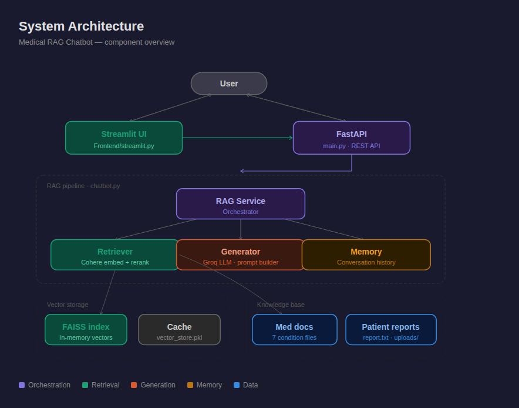
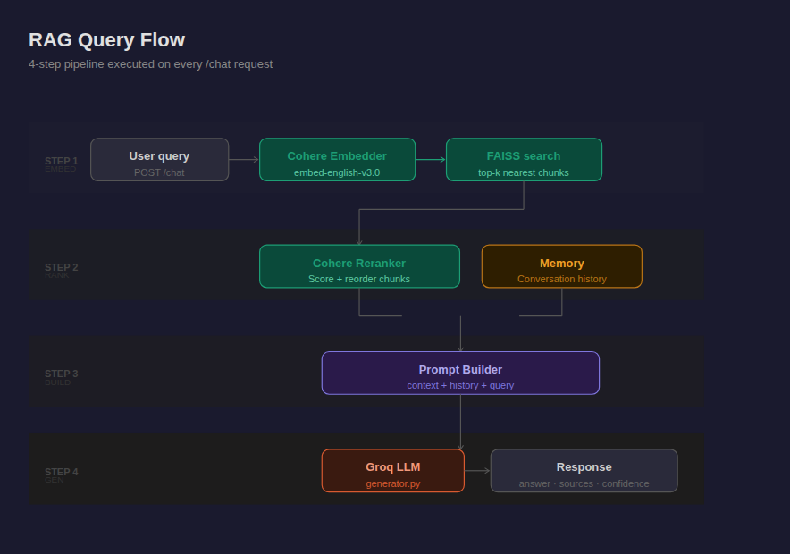
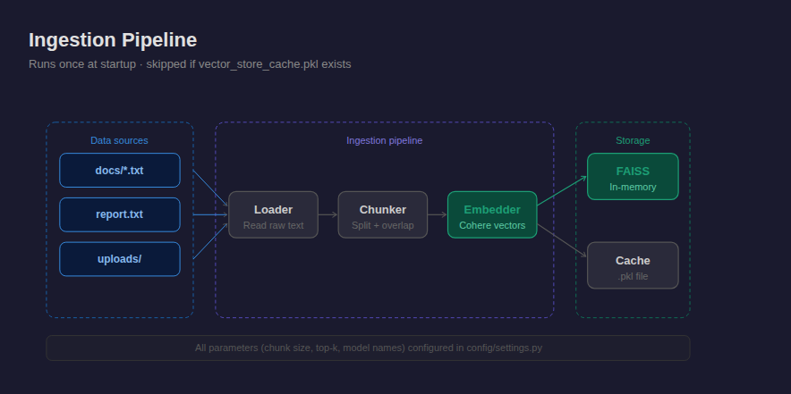

# 🧠 Medical RAG Chatbot

A Retrieval-Augmented Generation (RAG) chatbot specialized in medical documents and patient reports.  
Built with **Cohere Embeddings**, **Cohere Reranker**, and **Groq LLM** — served via **FastAPI** with a **Streamlit** frontend.

---

## 📁 Project Structure

```
project/
│
├── main.py                     # FastAPI entry point
├── chatbot.py                  # Core chatbot logic (also CLI entrypoint)
├── requirements.txt
├── .env                        # API keys (never commit)
├── .env.example                # Keys template
├── .gitignore
│
├── config/
│   └── settings.py             # All constants and config in one place
│
├── app/
│   ├── core/
│   │   ├── chunker.py          # Text chunking
│   │   ├── embedder.py         # Cohere embeddings + reranker
│   │   ├── vector_store.py     # In-memory FAISS store + cache
│   │   ├── memory.py           # Conversation memory
│   │   ├── prompt_builder.py   # Prompt construction
│   │   └── generator.py        # Groq LLM inference
│   │
│   ├── api/
│   │   └── routes.py           # API endpoints
│   │
│   └── models/
│       └── schemas.py          # Request/Response Pydantic schemas
│
├── Frontend/
│   └── streamlit.py            # Streamlit chat UI
│
└── data/
    ├── report.txt              # Patient report
    ├── vector_store_cache.pkl  # Auto-generated index cache
    ├── uploads/                # Future: uploaded reports via API
    └── docs/
        ├── brain_edema.txt
        ├── brain_tumors.txt
        ├── glioma.txt
        ├── hydrocephalus.txt
        ├── mass_effect.txt
        ├── meningioma.txt
        └── pituitary_adenoma.txt
```

---

## 🏗️ System Architecture



---

## 🔄 RAG Query Flow

When a user sends a message, the system executes 4 steps in sequence:



---

## 📥 Ingestion Pipeline

Runs once at startup. Skipped if `vector_store_cache.pkl` already exists.



---

## ⚙️ Installation

```bash
pip install -r requirements.txt
cp .env.example .env
# Fill in your API keys in .env
```

### Required keys (`.env`)

```env
COHERE_API_KEY=your_cohere_key
GROQ_API_KEY=your_groq_key
```

---

## 🚀 Running

**Backend API:**
```bash
uvicorn main:app --reload
```

**Streamlit frontend:**
```bash
streamlit run Frontend/streamlit.py
```

**CLI mode:**
```bash
python chatbot.py
```

---

## 📡 API Endpoints

| Method | Endpoint  | Description                          |
|--------|-----------|--------------------------------------|
| GET    | `/`       | Health check                         |
| GET    | `/health` | Chunk count + memory status          |
| POST   | `/chat`   | Send query, receive answer           |
| POST   | `/reset`  | Clear conversation memory            |

Swagger UI: `http://localhost:8000/docs`

---

## 🔗 Frontend Integration

```javascript
const res = await fetch("http://localhost:8000/chat", {
  method: "POST",
  headers: { "Content-Type": "application/json" },
  body: JSON.stringify({ query: "explain my patient report" })
});
const data = await res.json();
// data.answer | data.sources | data.confidence_label
```

---

## 🧩 Key Components

| Component | File | Role |
|---|---|---|
| Embedder | `app/core/embedder.py` | Cohere `embed-english-v3.0` + reranker |
| Vector store | `app/core/vector_store.py` | FAISS index with `.pkl` cache |
| Chunker | `app/core/chunker.py` | Splits docs into overlapping windows |
| Memory | `app/core/memory.py` | Per-session conversation turns |
| Prompt builder | `app/core/prompt_builder.py` | Assembles context + history + query |
| Generator | `app/core/generator.py` | Groq LLM inference |
| Config | `config/settings.py` | Central config for all parameters |

---

## 📚 Medical Knowledge Base

Pre-loaded with 7 neurology / neurosurgery condition documents:

| File | Condition |
|---|---|
| `brain_edema.txt` | Brain edema |
| `brain_tumors.txt` | Brain tumors (general) |
| `glioma.txt` | Glioma |
| `hydrocephalus.txt` | Hydrocephalus |
| `mass_effect.txt` | Mass effect |
| `meningioma.txt` | Meningioma |
| `pituitary_adenoma.txt` | Pituitary adenoma |

---

## 🛡️ Notes

- `vector_store_cache.pkl` is auto-generated on first run — delete it to force a full re-index.
- `.env` is git-ignored. Never commit API keys.
- The Streamlit frontend runs independently and calls the FastAPI backend over HTTP.
- Conversation memory is per-session and resets when the server restarts. Use `POST /reset` to clear it manually.

---

## 📦 Tech Stack

| Layer | Technology |
|---|---|
| API server | FastAPI + Uvicorn |
| Frontend | Streamlit |
| Embeddings | Cohere `embed-english-v3.0` |
| Reranker | Cohere Rerank |
| LLM | Groq (Llama / Mixtral) |
| Vector store | FAISS (in-memory) |
| Config | Pydantic Settings |